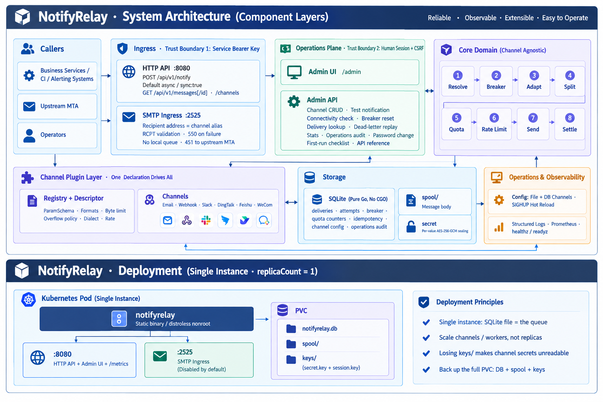
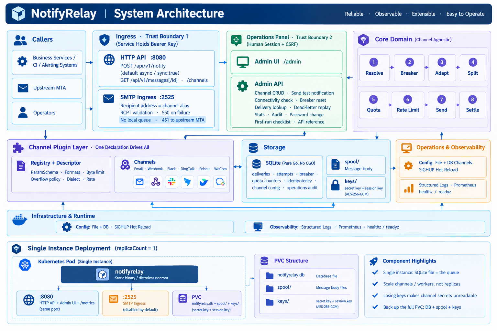

# NotifyRelay

> **One integration, every channel.**

An internal notification relay. Producers integrate once — an HTTP POST or an
email — and the service owns everything after that: which channels a message
reaches, in what markup, under what allowance, what happens when a channel is
down, and what was actually delivered.

[](https://github.com/1wu-davy-2/NotifyRelay/actions/workflows/docker.yml)
[](https://github.com/1wu-davy-2/NotifyRelay/actions/workflows/helm.yml)

**English · [中文](README.md)**

---

**Contents**

- [Why this exists](#why-this-exists)
- [Quick start](#quick-start)
- [Core design](#core-design) — channel abstraction, the five result classes, retry, breaker, quota
- [Architecture](#architecture) — layers, data flow, packages, swapping the database
- [Channels](#channels) — the six types, markdown dialects, byte limits
- [Configuration](#configuration)
- [Deployment](#deployment) — Compose, Helm, systemd
- [Operations](#operations) — probes, hot reload, and what has not been verified
- [Extending](#extending) — a new channel type, another database
- [Development](#development) — build, test, project status
- [Design documents](#design-documents)
- [Acknowledgements](#acknowledgements)
- [License](#license)

---

## Why this exists

Every service that needs to tell a human something ends up with its own SMTP
client, its own Slack webhook, and its own retry loop that is really a `for`
loop with a sleep in it. The credentials for every channel are copied into
every service, so rotating one means a deployment of all of them. Adding a
channel means changing every producer. Nothing records what was sent, so when a
page does not arrive, the answer is a search through N services' logs.

NotifyRelay is one process in the middle that owns the hard part.

| | Each service sends its own | Direct to a SaaS | NotifyRelay |
|---|---|---|---|
| **Integration cost** | N services × M channels | N services × M vendors | One POST, once |
| **Credentials** | Every service holds every channel's secret | Every service holds every vendor token | In one place, sealed at rest |
| **Adding a channel** | Change every producer | Change every producer | Add a config entry |
| **Retry, rate limit, breaker** | Reimplemented (or skipped) per service | Whatever the vendor does | Owned centrally, per channel |
| **Delivery record** | Scattered across N log streams | Split across vendors | One query, with attempt history |
| **Message content** | Yours | Leaves your network | Stays on your network |
| **What it costs you** | Nothing to run, forever to maintain | A subscription | A service to operate |

The last row is not a formality. This is a thing you run, back up and get paged
about. It earns that by being the only component that has to know about
channels — not by being free.

**What it is not**: a paging system, an on-call scheduler, or an escalation
policy engine. It delivers a message to a destination, once you have decided
what the message is and where it goes.

---

## Quick start

**One command.** No configuration file to write first, no keys to generate, no
password hash to compute:

```bash
git clone https://github.com/1wu-davy-2/NotifyRelay.git && cd NotifyRelay
docker compose up -d
```

Open `http://localhost:18080/admin`. The first visit offers to create an
administrator. After that, channels and API keys are added from the same place.

None of the following is something you do by hand; it is listed so you know it
happened:

| | |
|---|---|
| **The two keys** | Generated into `keys/` in the data directory on first boot, mode 0600, read back on every boot after. |
| **The administrator** | Nothing is pre-set. Whoever opens the UI first creates it, and that page closes permanently. They land on a four-step checklist: channel, API key, send a test notification, read the result. |
| **API keys** | Created on the **密钥** (Keys) page. The plaintext is shown once. |
| **Channels** | Added on the **渠道** (Channels) page. |

> **The window that comes with that.** Between the container starting and you
> opening the UI, whoever reaches it first becomes the administrator. On an
> internal network, done immediately, that window is small — and the startup log
> says so explicitly. To remove it entirely, put `admin.password_hash` in a
> configuration (generate one with
> `docker compose run --rm notifyrelay --hash-password '...'`) and the page is
> never offered.

If 18080 is taken, set `NOTIFYRELAY_HTTP_PORT=<another port>` in `.env` — the
compose file does not need editing. Only the host side moves: the service listens
on 8080 inside the container either way.

Confirm it is up. The image is distroless, so the probe is the binary itself:

```bash
docker compose exec notifyrelay /notifyrelay --healthcheck 127.0.0.1:8080
```

With a channel and an API key created in the UI, send something:

```bash
curl -X POST http://127.0.0.1:18080/api/v1/notify \
  -H "Authorization: Bearer $TOKEN" \
  -H "Content-Type: application/json" \
  -d '{
        "targets": ["oncall"],
        "title": "Replication lag on db-03",
        "body": "**lag**: 12s",
        "format": "markdown",
        "type": "warning"
      }'
```

`$TOKEN` is the string shown when the key was created, starting `nr_`. **Only
its digest is stored, so it cannot be shown again** — if it is lost, delete the
key and make another.

That one goes to the destination the channel was configured with, which is what
an alert wants. **Registration mail and password resets** have a recipient that
exists only in the request — add a `to` field, or the equivalent `mailto://`
target:

```bash
curl -X POST http://127.0.0.1:18080/api/v1/notify \
  -H "Authorization: Bearer $TOKEN" \
  -H "Content-Type: application/json" \
  -d '{
        "targets": ["email:tx"],
        "to":      ["user@example.com"],
        "title":   "Reset your password",
        "body":    "https://example.com/reset/abc"
      }'
```

Two things to know first: those recipients **replace** the channel's configured
ones rather than adding to them, and they are checked against the API key's
**recipient allow list** — empty means none, so an alerting key needs nothing
while a transactional one is granted `@yourdomain` or `*` on the keys page. Both
rules exist so that this does not become a service that mails anybody for
whoever holds a key.

The response is `202` with a delivery id, because delivery is asynchronous by
default:

```json
{
  "request_id": "96b3604fede17b44",
  "accepted": true,
  "deliveries": [
    {"id": "282d67a1b3c4e5f6", "target": "oncall", "channel_type": "webhook", "status": "queued"}
  ]
}
```

Ask what happened to it:

```bash
curl -H "Authorization: Bearer $TOKEN" \
     http://127.0.0.1:18080/api/v1/messages/282d67a1b3c4e5f6
```

```json
{
  "delivery": {"status": "sent", "attempts": 2, "last_error": "peer said try later"},
  "attempts": [
    {"attempt_no": 1, "class": "TRANSIENT", "elapsed_ms": 42},
    {"attempt_no": 2, "class": "SENT", "elapsed_ms": 31}
  ]
}
```

`GET /api/v1/messages?status=failed&target=oncall&limit=50` lists dead letters.

**Synchronous mode**: add `"sync": true` to wait for the outcome. The response
then carries a result per target — never one overall status, because collapsing
a fan-out into a single word is how a partial failure gets hidden.

**Idempotency**: send an `Idempotency-Key` header and a repeat submission
replays the original response byte for byte (`Idempotent-Replay: true`), while
the channel sees one message.

**SMTP inbound**: the recipient address carries the routing instruction.

```
<alias>[.<severity>]@<hostname>

oncall@relay.local             -> channel "oncall", type info
oncall.failure@relay.local     -> channel "oncall", type failure
ops.team.warning@relay.local   -> channel "ops.team", type warning
```

An unknown alias is refused at RCPT time with a 550 rather than silently
dropped. Downstream outcomes map onto SMTP replies: retryable becomes 4xx so the
sending MTA retries on its own schedule, permanent becomes 5xx.

### `POST /api/v1/notify` fields

| Field | Required | |
|---|---|---|
| `targets` | ✅ | Channel aliases, `type:alias`, or a channel URL `mailto://user@example.com?via=tx`. Mixable |
| `to` | | Recipients, for channels that take them (email today). Equivalent to a `mailto://` target; use one or the other |
| `title` | ✅ | |
| `body` | ✅ | |
| `format` | | `text` \| `markdown` \| `html`, default `text`. **Declared by the caller; the service does not guess** |
| `type` | | `info` \| `success` \| `warning` \| `failure`, default `info` |
| `priority` | | 1–5 |
| `tags` / `links` / `at` / `meta` | | Labels, structured links, @-mentions, channel-private extensions |
| `sync` | | `true` waits for delivery |

The full reference — every endpoint including the operator API, every field,
status code and error code — is [`docs/07-api.md`](docs/07-api.md) (Chinese).

There is also a copyable version inside the operator UI, under **API** in the
sidebar: the same endpoints and error codes, plus complete worked examples in
curl, Go, Python, Java, C#, C and C++, with the base URL filled in from the
address you reached the page on.

The interface itself is **Chinese by default, switchable to English** from the
sidebar. The choice is kept in a cookie, so it survives navigation and reloads.
The copy table lives in `internal/admin/i18n` and is a struct rather than a map:
a missing translation is a compile error, not a blank space somebody finds in
production.

---

## Core design

### Channel abstraction: adding one is a new package and one import line

```go
// internal/channel/all/all.go
import (
    _ "github.com/1wu-davy-2/NotifyRelay/internal/channel/dingtalk"
    _ "github.com/1wu-davy-2/NotifyRelay/internal/channel/email"
    // one line per channel type
)
```

Nothing in the router, the message model, format conversion, rate limiting,
quota, breaking or auditing changes. A channel declares what it needs and what
it can do through a `Descriptor`: a `ParamSchema` (type, required, private,
default, enum, label, description, `ShowIf`, `Min`/`Max`), the formats it
accepts, its byte limit, its overflow policy, its dialect, its rate limit.

That declaration is not documentation — it drives four separate things: the
config validator, the `/api/v1/channels` document, the credential redactor, and
the operator UI's forms. A channel that declares `private: true` on a field gets
it sealed at rest, scrubbed from errors, and rendered as a password box, without
writing code for any of the three.

**A test enforces the boundary**: a channel name appearing as a string literal
in a core package fails the build.

### Error classification and delivery guarantees

Every call to a channel ends in exactly one of five classes. The class is the
whole contract between a channel implementation and the queue — a channel
returns a class, and the queue's behaviour follows from it and nothing else.

| Class | Meaning | What the queue does |
|---|---|---|
| `SENT` | The peer accepted it | Done |
| `PERMANENT` | The peer rejected it and will reject it again | Dead-lettered immediately, never retried |
| `TRANSIENT` | The peer said try later | Retried on the configured backoff, dead-lettered when the budget runs out |
| `CONNECT_ERROR` | Tried, could not reach the peer | **Returned to the queue without spending an attempt** |
| `NOT_ATTEMPTED` | Never tried at all | **Returned to the queue without spending an attempt** |

The last two rows are the point of the whole design. When several channels fail
at once, charging an attempt for a call that never reached the peer lets one
outage burn through every message's retry budget and dead-letter the lot — the
relay would turn a recoverable downstream outage into permanent data loss.
`retry.max_age` is what stops the free retries from going on forever.

`CONNECT_ERROR` means *we tried and could not get there*. A delivery held back
by an open breaker, a spent allowance or a rate limit never touched the channel
at all, and reporting that as a connection failure lets a connection that never
happened explain the message's fate. Those report `NOT_ATTEMPTED`, carrying a
`skip_reason` naming which limit it was:

| `skip_reason` | Meaning |
|---|---|
| `breaker_open` | The channel is known to be failing; deliveries are held back |
| `quota_exhausted` | Its allowance for the window is spent |
| `rate_limited` | No rate-limit slot could be waited out |

> **Invariant: `skip_reason` is present if and only if the class is
> `NOT_ATTEMPTED`.** A message split in two, whose first part went out and whose
> second was blocked by quota, reports no reason — the channel did receive the
> message, and folding a fan-out's results lets "not attempted" yield to the
> real outcome.

`NOT_ATTEMPTED` is the zero value of the enum, and the classes are ordered
`NOT_ATTEMPTED < SENT < CONNECT_ERROR < TRANSIENT < PERMANENT`, so the
maximum-fold that combines a split message's parts produces the right answer
without a special case.

It surfaces in the synchronous response, in the audit log, and in the attempt
history at `GET /api/v1/messages/{id}`. Over SMTP it answers **451** — so the
sending MTA retries on its own schedule — rather than 550, because a
notification that is merely held back should not be bounced at that point.

`PERMANENT` is deliberately **not** counted as a channel fault. The endpoint
answered, and it answered correctly; the problem is the message. Counting it
would let one bad recipient address take a whole channel out of service.

### Retry: fixed increasing intervals

```
retry:
  max_attempts: 5
  backoff: [30s, 2m, 10m, 1h, 4h]
  max_age: 24h
```

Not exponential backoff. Mail and IM failures are dominated by greylisting and
temporary 4xx, where the first few exponential steps (30s, 60s) are far too
dense to let a transient condition clear, and the later ones overshoot into
hours. A hand-picked ladder that matches how those failures actually resolve
does better than a formula that does not know what it is waiting for.

`max_age` is the outer bound: a delivery that keeps being released without
charge — because the channel is unreachable or out of quota — is eventually
given up on rather than retried forever.

### Breaker and quota

**Circuit breaker.** A channel that keeps failing is taken out of service, so
deliveries fail fast instead of each one waiting out a connect timeout. The
state is **written to the database**, because a restart must not forget an
outage that is still in progress — the restart is often part of the incident,
and letting a fresh process pour the backlog into a downstream that has not
recovered turns one outage into two.

After `open_timeout` the breaker moves to **half-open and admits only
`half_open_probes` requests at a time**. It does not close on a timer. A
channel that has just come back should be *tested*, not handed the backlog; and
a breaker that closed itself every 60 seconds would not be a breaker at all. A
failed probe reopens it immediately rather than waiting for the remaining
probes — the conservative direction, since the cost of being wrong is a
delivery that hangs. A probe that is abandoned without a verdict returns its
slot (`breaker.Abandon`) so the half-open budget cannot leak.

`failure_threshold` counts consecutive `TRANSIENT` and `CONNECT_ERROR`
results. `PERMANENT` never counts.

**Quota.** Each channel instance may declare an allowance
(`quota.per_second/minute/hour/day/month`). The allowance is **reserved before
the call** and settled by the outcome:

| Outcome | Settlement |
|---|---|
| Sent, rejected, or told to try later | **Commit** — the peer really was called |
| Never reached the peer | **Rollback** — nothing to charge for |

A counter incremented after the call cannot refuse the call that would exceed
the limit, which is the entire reason the reservation exists. Without the
settlement distinction, a channel that was unreachable for an hour would spend
a day's allowance on messages nobody received and then be refused for the rest
of the day. A delivery that cannot get a slot goes back to the queue rather
than failing, and does not spend a retry attempt.

Short windows slide; day and month are fixed periods and are persisted, because
that is what a platform's allowance means and a restart must not forget what
was already spent.

**The operator can reset a breaker by hand** in the UI. After a downstream
recovers, or after an operator restarts it, nobody should have to wait out
`open_timeout` to find out.

### What "at least once" actually means

The queue is durable and the guarantee is **at least once**, not exactly once.
A delivery claimed and not written back within `claim_timeout` is treated as
abandoned and returned to the queue. The test is against the *claim*, not
against a restart, so a killed process, a stuck worker and a power cut are all
covered by the same sweep — and the price is that **a delivery that actually
succeeded but failed to write back is sent again**. Producers must tolerate
duplicates.

Quota and rate limiting are best-effort boundaries, not a ledger. Second-,
minute- and hour-windows live in memory and a restart loses a few seconds of
counting. That is deliberate: persisting them would cost a write per delivery
to buy an accuracy nobody needs.

---

## Architecture

### The layers



Six columns, and the dependency arrows only ever point one way. The core domain
is the one stretch of code that does not know `dingtalk` exists; all channel
knowledge lives in the plugin layer to its right. The two trust boundaries are
clearest here as well: ingress authenticates a bearer key held by a service, the
operations panel authenticates a session held by a person plus CSRF — which is
why `internal/admin` is a package of its own.

### What happens to one message

```
  producers                 relay                         channels

  HTTP API         ─┐     ┌─────────────────────────────────────┐
  /api/v1/notify    ├────▶│ resolve targets → build deliveries  │
  SMTP inbound     ─┘     └──────────────────┬──────────────────┘
  :2525
                                             │ enqueue
                                             ▼
                          ┌─────────────────────────────────────┐
                          │ durable queue (SQLite)              │
                          │ + message bodies on disk            │
                          └──────────────────┬──────────────────┘
                                             │ claim (worker pool)
                                             ▼
                          ┌─────────────────────────────────────┐
                          │ resolve ▶ breaker ▶ dialect ▶ split │
                          │ ▶ quota reserve ▶ rate limit ▶ SEND │
                          └──────────────────┬──────────────────┘
                                             │ settle → attempt, class, skip_reason
                                             ▼
                          ┌─────────────────────────────────────┐
                          │ audit · metrics · spool             │
                          └─────────────────────────────────────┘
```

That order is not arbitrary, and it is the part worth reading twice:

- **The breaker comes first.** A message held back because the channel is down
  must not also spend the channel's allowance, or one outage eats the day's
  quota without a single message being sent.
- **The split comes before the reservation**, because a body cut into three
  parts is three calls to the endpoint and the platform counts them that way.
  Reserving first would under-count exactly the messages that cost the most.
- **The allowance is reserved before the rate limiter waits**, so a delivery
  that gives up waiting for a token releases an allowance it never used.
- **Settle runs on every path out of the send** — success, rejection and
  failure alike — which is what makes the quota rollback and the breaker's
  half-open probe accounting correct when things go wrong, not just when they
  go right.

### The full architecture



The whole picture in one image; the deployment form is its lower half. The parts
that are easy to forget when reasoning about the system: that the operator UI is
served from the same port as the API, that a `sync: true` request takes a
different path through the queue than the default asynchronous one, that `spool`
and `secret` are storage concerns the core never touches directly, and that the
SMTP ingress never enters the local queue — it validates the recipient and hands
the message back to the upstream MTA, answering 451 so the upstream retries.

### Packages

```
cmd/notifyrelay/         the binary: flags, wiring, signals, reload
web/                     the admin interface (React + Vite). Its build output is
                         embedded into the binary by web/embed.go
  web/src/pages/         the screens; the route table is web/src/App.tsx
  web/src/lib/schema.ts  the channel form: the only form logic that is the browser's
  web/scripts/           generates TypeScript types from the Go copy table
internal/
  api/                   POST /api/v1/notify, /messages, /channels
  smtpin/                SMTP inbound; recipient address as routing instruction
  router/                fan-out: target resolution, dialect, splitting, audit, and the
                         atomic snapshot that makes a reload invisible to in-flight work
  channel/               the interface, the registry, the ParamSchema, and one package
                         per channel type (email, webhook, slack, dingtalk, feishu, wecom)
  channel/all/           the import list — the only file a new channel edits outside its own package
  channel/httpx/         shared HTTP client behaviour and error classification
  channel/httpauth/      bearer / basic / header / HMAC signing
  channel/token/         cached, refreshed access tokens (WeCom)
  message/               the channel-agnostic message model and its templates
  render/                markup conversion between dialects
  queue/                 worker pool, retry policy, orphan sweep, dead letters, replay
  breaker/               per-channel circuit breaker state machine
  quota/                 sliding and fixed windows, reserve and settle
  store/                 the persistence interfaces
  store/sqlite/          the first implementation: WAL, _txlock=immediate
  store/spool/           message bodies on disk, so the queue table stays small
  audit/                 attempt records
  auth/                  API key digests and argon2id passwords
  admin/                 operator API and UI: sessions, channel CRUD, breaker reset,
                         replay, test notifications, the first-run checklist,
                         password change, the API reference page
  admin/i18n/            the interface copy table, one per language. A **struct, not a
                         map** — a missing translation is a compile error
  admin/samples/         the worked examples, one directory per language
  admin/static/          the stylesheet the "frontend not built" page borrows
  config/                the configuration file, and the channel store that lives in the database
  secret/                sealing individual credential values at rest
  metrics/               Prometheus instrumentation
  requestid/             correlation ids spanning a fan-out
```

### Swapping the database

`internal/store` is the seam. The interfaces are **relational-shaped but not
SQL-shaped**: a claim reads and marks in one step, which SQLite does with an
immediate transaction and MySQL does with `SELECT ... FOR UPDATE SKIP LOCKED`.
Nothing above that package knows which engine is underneath.

`storage.driver` is named explicitly in the configuration even though `sqlite`
is the only implementation today, because that field is where a later
deployment announces itself. The switch in `openStore()` is the only place that
has to change.

---

## Channels

| Type | Notes | Formats | Rate |
|---|---|---|---|
| `email` | Via an upstream SMTP relay; each recipient delivered independently | text, html | unlimited |
| `webhook` | Generic JSON POST, templated payload, bearer/basic/header/HMAC auth | text, markdown, html | configurable |
| `slack` | Incoming webhook or bot token | text, markdown | 1/s |
| `dingtalk` | DingTalk group robot, with optional signing and @-mentions | text, markdown | 20/min |
| `feishu` | Feishu custom bot with optional signing; card header colour carries severity | text, markdown | ~100/min |
| `wecom` | WeCom group robot, or an application with cached, refreshed tokens | text, markdown | 20/min |

`GET /api/v1/channels` returns every registered type with its parameter schema
and capabilities — enough to write a valid configuration without reading the
source.

A parameter declared `private` appears nowhere in that document — and nowhere in
a delivery failure either. A transport error renders the whole URL, and for
DingTalk, Feishu, Slack and WeCom the URL **is** the credential: the token is in
the query string or the path. So errors keep `scheme://host` and drop the rest,
and the router scrubs every value the schema declares private from everything it
emits.

### Markdown is not one format

Slack's mrkdwn uses `*single stars*` for bold and `<angle|brackets>` for links;
DingTalk, Feishu and WeCom do not render `#` headings at all. Sending CommonMark
to them does not fail — it just puts literal asterisks and hashes in front of a
reader.

Channels declare a dialect and **the core does the conversion**, so no channel
implementation contains a converter:

| Input | DingTalk | Feishu / WeCom | Slack |
|---|---|---|---|
| `# Heading` | kept | `*Heading*` | `*Heading*` |
| `**bold**` | kept | kept | `*bold*` |
| `*italic*` | kept | kept | `_italic_` |
| `[text](url)` | kept | kept | `<url\|text>` |

### Length limits are byte limits

A channel's declared limit is a promise about **the payload the platform
receives**, not about the body alone — the router subtracts the title, the links
and the channel's own markup before splitting. DingTalk's 20000 and WeCom's 4096
are **bytes**, not characters: counting characters would treat ten thousand CJK
characters (30000 bytes) as comfortably under the limit.

---

## Configuration

See [`configs/notifyrelay.example.yaml`](configs/notifyrelay.example.yaml) —
every field is commented. Three rules are not negotiable, and the service
refuses to start rather than let you break them:

1. **Secrets never go in the file.** Write `!env VAR_NAME`; the value is read
   from the environment at startup, and a missing variable fails startup loudly
   instead of silently becoming an empty credential.
2. **Timeouts must be set explicitly.** `timeouts.handler` (one whole request,
   including fan-out) must exceed `timeouts.deliver` (a single target), or
   fan-out is cut off mid-flight.
3. **`queue.claim_timeout` must exceed `queue.deliver_timeout`**, or a slow
   delivery is mistaken for an abandoned one and sent twice.

Channel configuration lives in the **database**, not the file. The `channels:`
block seeds it once, on the first boot of a build that stores channels there,
and is ignored afterwards — so an operator who deletes a channel in the UI does
not find it back after the next restart. The marker recording that lives in the
`meta` table; deleting that row is how you ask for the import to happen again.

Credentials in the database are **sealed per field** (AES-256-GCM), and which
fields count as credentials is read from the channel's own `ParamSchema` — the
same declaration that drives redaction and the UI forms. With no `secret_key`
configured, storing a credential is refused rather than written in the clear.

---

## Deployment

The deployment form is the lower half of the full architecture diagram in
**Architecture** above: one pod, two ports, one PVC.

One instance, two ports, one volume. The volume is the whole of the state — the
queue, the channel configuration, the message bodies, **and both keys**
(`keys/secret.key` and `keys/session.key`, generated on first boot, mode 0600) —
which is why the backup is "copy a directory" rather than a list of things to
remember.

> Lose `secret.key` and every channel credential in the database becomes
> ciphertext nobody can read. Keeping the key beside the data is a deliberate
> trade: an earlier version required it to be configured separately, on the
> grounds that a backup of nothing but ciphertext is not a backup, and what that
> bought was a backup that could not be restored. The cost is written up in the
> operations manual, §2.

```bash
# Docker Compose
# Docker Compose — no preparation step. The image carries its own configuration,
# the two keys are generated on first boot, and the administrator account is
# created in the browser. `.env` is only for changing the ports or injecting
# channel credentials.
docker compose up -d

# Kubernetes
helm install notifyrelay deploy/helm/notifyrelay \
  --set image.repository=<your-registry>/notifyrelay --set image.tag=<version>

# Bare metal / VM
install -m 0755 notifyrelay /usr/local/bin/
install -m 0644 deploy/systemd/notifyrelay.service /etc/systemd/system/
systemctl enable --now notifyrelay
```

The image is distroless: no shell, no curl. The container healthcheck is
therefore the binary probing itself (`--healthcheck`), and Compose and
Kubernetes both use it.

**One replica, always.** The queue is a single SQLite file. A second replica
would be a second relay with its own queue rather than a copy of this one, so
the chart pins `replicas: 1` and the volume is `ReadWriteOnce` — SQLite takes an
exclusive lock and a network filesystem does not honour it.

---

## Operations

**The probes are split on purpose.** `GET /healthz` is liveness and **does not
touch the database**; `GET /readyz` is readiness and **does check it**. A
liveness probe that fails on a dependency outage gets the process restarted,
which fixes nothing and loses in-memory state, while a readiness probe that
skipped the check would accept notifications the service cannot store.

`GET /metrics` is Prometheus, unauthenticated.

**Reload without a restart**: `systemctl reload notifyrelay` (or `kill -HUP`).
Log level, API keys, timeouts, the retry cadence, breaker thresholds and the
channel configuration all take effect. The listen address, storage paths, worker
count and `secret_key` need a restart, and **the service names them in its log**
rather than leaving you to guess which half of your edit landed — `reload: done`
does not mean everything was applied. A configuration file that fails to parse
leaves the running one in place.

The operator UI is **off by default in the binary** (`admin.enabled: false`) and
**on by default in the container image**. The two defaults differ on purpose:
starting a service by hand on a machine should not also open a management
interface nobody asked for, and the whole point of the image is that it can be
configured without an editor — which needs one. It can change every channel's
configuration, so it is considerably more sensitive than the notification API:
sessions live in server memory, credentials never travel back to the browser,
state-changing requests need a custom header *and* a `SameSite=Lax` cookie, and
every one of them is written to an audit table.

### What has not been verified

Full detail, with a trigger condition for each, is in
[`docs/06-operations.md`](docs/06-operations.md) §8 (Chinese). The short
version, because a README that only lists what works is a README that lies by
omission:

| | Status |
|---|---|
| DingTalk / Feishu request signing | **Never tested against the real platform.** Unit tests prove we compute a signature per the documentation, not that the other side accepts it |
| Docker image | ✅ Built and run in CI |
| Helm chart | Rendering ✅ in CI; **`helm install` never run** — needs a cluster |
| systemd unit | **Never started under systemd**; only the directives are checked |
| SIGHUP delivery | **Not verifiable on Windows**; the reload logic is tested, `signal.Notify` is not |
| 15-minute usability test | **Pending a human.** Someone who has not read this project, given only this README, on a Linux box with Docker and an upstream SMTP |

Unit tests passing is not the peer accepting the signature; a local build
succeeding is not the image running. Writing down what has not been tried is
more useful than pretending it has been.

---

## Extending

### A new channel type

A channel package implements five methods and registers itself:

```go
func init() {
    channel.Register(channel.Descriptor{
        Type:        "mattermost",
        ParamSchema: paramSchema(),
        Capability:  capability(),
        Factory:     New,
    })
}
```

| Method | What it answers |
|---|---|
| `Type()` | The stable identifier used in configuration |
| `ParamSchema()` | Which configuration it accepts — and which of those fields are credentials |
| `Capability()` | Formats it renders, byte limit, overflow policy, dialect, rate |
| `Send()` | Deliver, and classify the outcome into exactly one of the five classes |
| `Test()` | A connectivity self-check that sends no real notification |

Then one import line in [`internal/channel/all/all.go`](internal/channel/all/all.go),
and that is the whole change. The router, the queue, format conversion, rate
limiting, quota, breaking and auditing do not move.

Three rules the core depends on:

1. **Classify every failure.** Returning an unclassified error is a bug — the
   five classes are the entire contract between a channel and the queue, and
   everything the queue does follows from them.
2. **No cross-cutting behaviour inside the channel.** No retry, no rate
   limiting, no format conversion, no auditing — the core does all of that
   *around* the implementation. A channel that retries internally gets retried
   again on top.
3. **Declare credentials `private`.** That one flag is what seals a value at
   rest, scrubs it from errors and renders it as a password field. A credential
   not declared private is a credential in the logs.

A test enforces the boundary from the other side: a channel name appearing as a
string literal in a core package fails the build.

### Another channel parameter

Nothing to change but the schema. One `ParamSpec` drives validation, the
`/api/v1/channels` document, credential redaction and the operator UI's form —
which is why a new parameter needs no code in any of the four.

### Another database

`internal/store` is the seam, and `openStore()` is the only switch — see
[Swapping the database](#swapping-the-database).

---

## Development

Requires **Go 1.25+** (`wneessen/go-mail` requires ≥ 1.25; an older toolchain
will download a newer one automatically).

```bash
# Windows
.\build.ps1 -Test              # vet + test + build to bin\notifyrelay.exe
.\build.ps1 -OS linux          # cross-compile

# Make (Git Bash / Linux / macOS)
make all                       # vet + test + build
make helm-lint                 # render the chart without a cluster
```

The build **pins `GOARCH=amd64` explicitly** rather than inheriting it: a 32-bit
host toolchain would otherwise produce a 32-bit binary.

**The admin interface has to be built before the binary is.** It is a React
project, and its output is embedded into the binary by `web/embed.go` with
`//go:embed`:

```bash
cd web && npm install && npm run build
cd .. && go build ./...
```

The build scripts deliberately do **not** run that for you: `go build ./...` has
to keep working in a checkout with no Node toolchain, and this repository's
backend has no use for one. The cost is that a binary built that way has no
interface — `/admin` answers with a page naming the two commands above, rather
than a blank screen.

Run the tests:

```bash
GOMAXPROCS=2 GOMEMLIMIT=1GiB go test ./... -p 2 -parallel 2
```

**The resource limits are not optional.** An unbounded `go test ./...` compiles
every package in parallel and pegs every core for a minute or two, making the
machine unusable while it runs. `build.ps1`, the `Makefile` and `make test` all
pass these already; the command above is for when you are typing it by hand.

Run it locally:

```bash
go run ./cmd/notifyrelay --config configs/notifyrelay.example.yaml
```

### Helper flags

| Flag | |
|---|---|
| `--hash-key <token>` | Print the `sha256:...` digest for `auth.api_keys` |
| `--hash-password <password>` | Print an argon2id hash for `admin.password_hash` |
| `--gen-key` | Print a new `secret_key` |
| `--seal-value <value>` | Seal a value with the configured `secret_key` |
| `--healthcheck <host:port>` | Probe a running instance; exits 0 or 1 |
| `--version` | Print the version and exit |

### Project status

| Milestone | Scope | |
|---|---|---|
| M0 | Project setup: config, logging, interface contracts, build artefacts | ✅ |
| M1 | Email MVP: email channel, send API, SMTP inbound, authentication | ✅ |
| M2 | Multi-channel abstraction: schema validation, rate limiting, webhook, Slack, `/channels` | ✅ |
| M3 | DingTalk / Feishu / WeCom, markdown dialects, token cache, byte-accurate limits | ✅ |
| M4 | Durable queue (SQLite), retry and dead letters, audit, idempotency, circuit breaker, quota, metrics | ✅ |
| M5 | Operator UI, configuration in the database, hot reload, deployment artefacts | ✅ *(except the human usability test above)* |

---

## Design documents

Written in Chinese. They are the reasoning behind the code, not a restatement
of it — the research that ruled options out, the decisions and what they cost.

| | |
|---|---|
| [`docs/00-research.md`](docs/00-research.md) | Survey of open-source notification projects, and the anti-patterns found in them |
| [`docs/01-tech-stack.md`](docs/01-tech-stack.md) | Language, libraries and dependencies, with the licence consequences of each |
| [`docs/02-scope.md`](docs/02-scope.md) | What is in scope, what is deliberately not, and the security red lines |
| [`docs/03-plan.md`](docs/03-plan.md) | The milestone plan, every open question and its resolution, and the implementation record |
| [`docs/04-notice-draft.md`](docs/04-notice-draft.md) | The draft the `NOTICE` file was built from |
| [`docs/05-paramschema-audit.md`](docs/05-paramschema-audit.md) | An audit of `ParamSchema` before the UI was written — what a form can and cannot be generated from |
| [`docs/06-operations.md`](docs/06-operations.md) | The operations manual: backup, upgrade, metrics, troubleshooting, and the unverified list |
| [`docs/07-api.md`](docs/07-api.md) | The API reference: every endpoint, field, status code and error code — including nine places where the API behaves in a way you would not guess |
| [`docs/08-ui-plan.md`](docs/08-ui-plan.md) | The plan the interface work followed: what the investigation found, the five phases, and why the redesign and the translation were done together |
| [`docs/i18n-inventory.md`](docs/i18n-inventory.md) | The string inventory: 236 pieces of interface copy counted one at a time, 64 channel-parameter labels, and the categories deliberately left in English |

---

## Acknowledgements

The email composition and encoding policy is derived from
[`kubesphere/notification-manager`](https://github.com/kubesphere/notification-manager)
(Apache-2.0). The channel-parameter model — type, required, default, enum and
validation declared in one schema that both the server and the form read — was
designed after studying notifo's `IntegrationProperty` (MIT).

Full attributions, source file paths and licences are in [`NOTICE`](NOTICE).

## License

**GNU Affero General Public License v3.0** — see [`LICENSE`](LICENSE).

Under AGPL section 13, users interacting with this software over a network are
entitled to its corresponding source.
