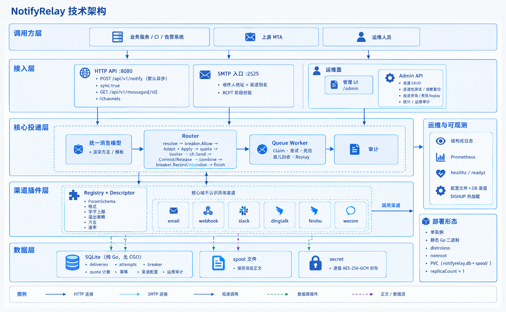
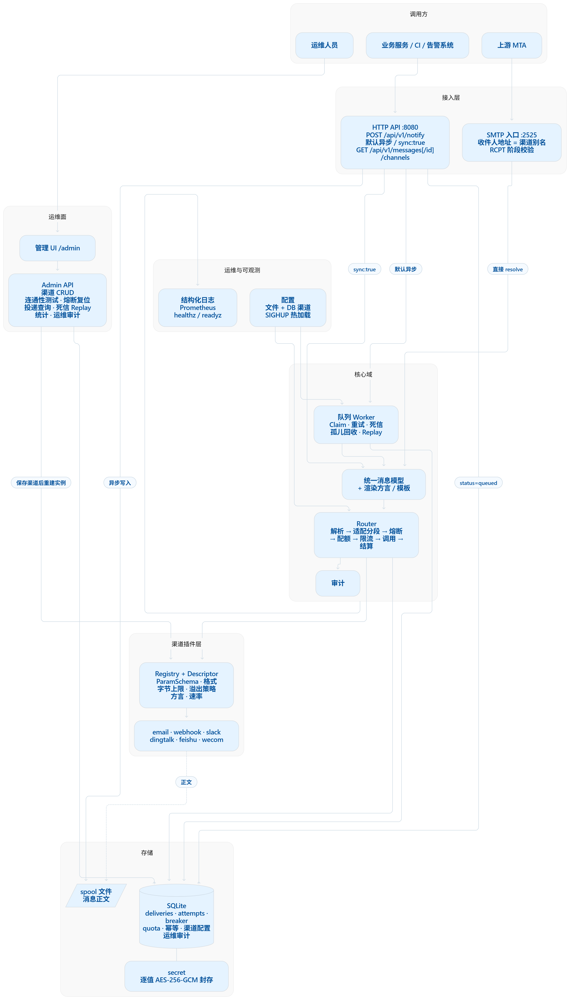
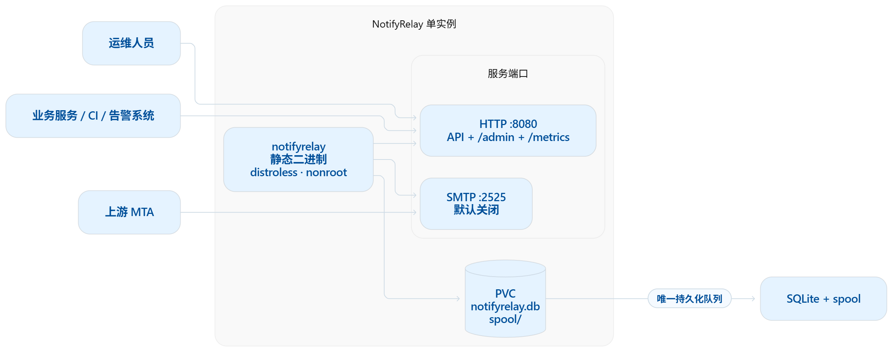

# NotifyRelay · 信使中枢

> **一次接入，多端送达。**

内部服务的统一通知中继。上游一次接入——一个 HTTP POST 或一封邮件——之后的事全归它管：
消息送到哪些通道、用什么标记语言、在什么额度之内、通道挂了怎么办、以及最后到底送出去了没有。

[](https://github.com/1wu-davy-2/NotifyRelay/actions/workflows/docker.yml)
[](https://github.com/1wu-davy-2/NotifyRelay/actions/workflows/helm.yml)

**[English](README.en.md) · 中文**

---

**目录**

- [为什么需要它](#为什么需要它)
- [快速开始](#快速开始)
- [核心设计](#核心设计) — 通道抽象、五分类、重试、熔断、配额
- [系统架构](#系统架构) — 分层、数据流、包结构、换数据库
- [通道](#通道) — 六种类型、markdown 方言、字节上限
- [配置](#配置)
- [部署](#部署) — Compose、Helm、systemd
- [运维](#运维) — 探针、热加载，以及还没验证的部分
- [二次开发](#二次开发) — 加一个通道类型、换一个数据库
- [开发](#开发) — 构建、测试、项目状态
- [设计文档](#设计文档)
- [致谢](#致谢)
- [License](#license)

---

## 为什么需要它

每一个需要告诉人点什么的内部服务，最后都会长出自己的一套东西：一个 SMTP 客户端、一个
Slack webhook、一个其实是"for 循环里 sleep 一下"的重试。每个渠道的凭据被复制进每一个服务，
轮换一次就要把所有这些服务都发一遍。加一个渠道意味着改所有上游。没有任何地方记录发过什么，
所以当一条告警没到的时候，答案是在 N 个服务的日志里翻。

NotifyRelay 就是中间那一个进程，把真正难的那部分接过来。

| | 各服务自己发 | 直连 SaaS | NotifyRelay |
|---|---|---|---|
| **接入成本** | N 个服务 × M 个渠道 | N 个服务 × M 个厂商 | 一次 POST，一次 |
| **凭据** | 每个服务都持有每个渠道的密钥 | 每个服务都持有每个厂商的 token | 集中一处，落库即密封 |
| **加一个渠道** | 改所有上游 | 改所有上游 | 加一条配置 |
| **重试 / 限流 / 熔断** | 每个服务各实现一遍（或者干脆没有） | 厂商给什么算什么 | 集中持有，按通道粒度 |
| **投递记录** | 散在 N 条日志流里 | 散在各个厂商后台 | 一次查询，带完整尝试历史 |
| **消息内容** | 自己的 | 出网 | 留在自己网内 |
| **代价** | 不用跑东西，但要一直还债 | 订阅费 | 多一个要运维的服务 |

最后一行不是客套。这是**一个你要跑、要备份、出问题会把你叫醒的服务**。它换来的是
"只有它需要知道渠道"——不是"免费"。

**它不做什么**：不是告警平台，不做值班排班，不做升级策略。你决定消息是什么、发给谁，
它负责把这条消息送出去。

---

## 快速开始

**一条命令。** 不需要先写配置文件，不需要先生成密钥，不需要先算密码哈希：

```bash
git clone https://github.com/1wu-davy-2/NotifyRelay.git && cd NotifyRelay
docker compose up -d
```

打开 `http://localhost:8080/admin`，第一次访问会看到「创建管理员」页面。建完账号，
通道、API Key 全部在后台里加。

下面这些都不需要你手动做，列出来是为了说明它们确实发生了：

| | |
|---|---|
| **两个密钥** | 首次启动生成到数据目录的 `keys/` 下，权限 0600。重启时读回来。 |
| **管理员账号** | 没有预置。第一个打开后台的人创建，之后那个页面永久关闭。 |
| **API Key** | 在后台的**密钥**页创建，明文只显示一次。 |
| **通道** | 在后台的**渠道**页添加。 |

> **先到先得的那段窗口。** 从容器启动到你打开后台之间，先访问的人会成为管理员。
> 内网部署 + 立刻完成，窗口极小；启动日志里也会明确写出这件事。
> 不想留这个窗口，就在配置里写死 `admin.password_hash`（用
> `docker compose run --rm notifyrelay --hash-password '...'` 生成），那个页面就不会出现。

8080 被占用的话，`.env` 里写 `NOTIFYRELAY_HTTP_PORT=18080` 即可，不用改 compose 文件。

确认它活着。镜像是 distroless，没有 shell，所以探针就是二进制自己：

```bash
docker compose exec notifyrelay /notifyrelay --healthcheck 127.0.0.1:8080
```

在后台建好一个通道、一个 API Key 之后，发一条：

```bash
curl -X POST http://127.0.0.1:8080/api/v1/notify \
  -H "Authorization: Bearer $TOKEN" \
  -H "Content-Type: application/json" \
  -d '{
        "targets": ["oncall"],
        "title": "数据库主从延迟告警",
        "body": "**延迟**: 12s\n**实例**: db-03",
        "format": "markdown",
        "type": "warning",
        "priority": 4
      }'
```

`$TOKEN` 是创建时显示的那一串，以 `nr_` 开头。**只存摘要，那一次之后就再也拿不回来了**——
丢了就删掉重建。

**默认异步**：入队即返回 `202` 与投递 ID。

```json
{
  "request_id": "96b3604fede17b44",
  "accepted": true,
  "deliveries": [
    {"id": "282d67a1b3c4e5f6", "target": "oncall", "channel_type": "webhook", "status": "queued"}
  ]
}
```

查它怎么了（含完整尝试历史）：

```bash
curl -H "Authorization: Bearer $TOKEN" \
     http://127.0.0.1:8080/api/v1/messages/282d67a1b3c4e5f6
```

```json
{
  "delivery": {"status": "sent", "attempts": 2, "last_error": "peer said try later"},
  "attempts": [
    {"attempt_no": 1, "class": "TRANSIENT", "elapsed_ms": 42},
    {"attempt_no": 2, "class": "SENT", "elapsed_ms": 31}
  ]
}
```

`GET /api/v1/messages?status=failed&target=oncall&limit=50` 可列死信。

**同步模式**：请求体加 `"sync": true`，等所有目标投递完再返回。返回的是**按目标分别的结果**，
不是一个总的成败——把一次扇出折叠成一个词，正是部分失败被藏起来的方式。

**幂等**：带上 `Idempotency-Key` 头，重复提交会**原样重放**首次的响应体
（`Idempotent-Replay: true`），且通道只会收到一条。

**SMTP 入口**：**收件人地址即路由指令**。

```
<通道别名>[.<级别>]@<hostname>

oncall@relay.local             -> 通道 "oncall"，级别 info
oncall.failure@relay.local     -> 通道 "oncall"，级别 failure
ops.team.warning@relay.local   -> 通道 "ops.team"，级别 warning
```

别名不存在时在 RCPT 阶段直接回 550，不会静默丢弃。下游失败按分类映射成 SMTP 状态码：
可重试 → **4xx**（让上游 MTA 自行重投），永久失败 → **5xx**。

### `POST /api/v1/notify` 字段

| 字段 | 必填 | 说明 |
|---|---|---|
| `targets` | ✅ | 通道别名数组，或 `类型:别名`。可混用 |
| `title` | ✅ | 标题 |
| `body` | ✅ | 正文 |
| `format` | | `text` \| `markdown` \| `html`，默认 `text`。**由调用方声明，服务端不猜** |
| `type` | | `info` \| `success` \| `warning` \| `failure`，默认 `info` |
| `priority` | | 1–5 |
| `tags` / `links` / `at` / `meta` | | 标签、结构化链接、@ 提及、通道私有扩展 |
| `sync` | | `true` 则等待投递完成 |

完整参考——每个端点（含管理 API）、每个字段、状态码与错误码——见
[`docs/07-api.md`](docs/07-api.md)。

后台里还有一份**可以直接复制**的版本：登录后点左侧的 **API**。同样的端点与错误码，
外加 curl / Go / Python / Java / C# / C / C++ 七种语言的完整调用示例，
服务地址按你当前访问的地址自动填好。

后台界面**中文为默认，可切英文**，选择记在 cookie 里，跨页面和刷新都保留。
界面文案的表在 `internal/admin/i18n`，是结构体不是 map——漏翻一条是编译错误，
而不是运行时的一块空白。

---

## 核心设计

### 通道抽象：加一个通道 = 新增一个包 + 一行 import

```go
// internal/channel/all/all.go
import (
    _ "github.com/1wu-davy-2/NotifyRelay/internal/channel/dingtalk"
    _ "github.com/1wu-davy-2/NotifyRelay/internal/channel/email"
    // 每个通道类型一行
)
```

核心路由、消息模型、格式降级、限流、配额、熔断、审计全部不动。通道通过一个 `Descriptor`
声明自己需要什么、能做什么：`ParamSchema`（类型 / 必填 / 私密 / 默认值 / 枚举 / 标签 /
描述 / `ShowIf` / `Min`/`Max`）、接受的格式、字节上限、溢出策略、markdown 方言、速率。

这份声明不是文档——它同时驱动四件事：配置校验、`/api/v1/channels` 的输出、凭据脱敏、
以及后台表单。一个字段声明了 `private: true`，就自动获得"落库密封、错误里擦除、表单里
渲染成密码框"三件事，不用为此写任何代码。

**这条边界由测试强制执行**：核心包里出现 `"email"` 这类通道名字面量就会失败。

### 错误分类与投递保证

每一次对通道的调用，结果恰好是五类之一。这个分类就是通道实现与队列之间的全部契约——
通道返回一个 class，队列的行为完全由它推导出来。

| 分类 | 含义 | 队列的处理 |
|---|---|---|
| `SENT` | 对端接受了 | 完成 |
| `PERMANENT` | 对端拒绝了，而且再发还是会拒绝 | 立即进死信，不重试 |
| `TRANSIENT` | 对端说稍后再试 | 按配置的退避重试，预算耗尽后进死信 |
| `CONNECT_ERROR` | 试过了，没能碰到对端 | **归还队列，不消耗重试预算** |
| `NOT_ATTEMPTED` | 根本没试 | **归还队列，不消耗重试预算** |

最后两行是整个设计的重点。下游集体故障时，若把连接失败也算作一次尝试，一次故障就会把所有
消息的重试预算烧光、全部打成死信——中继会把一次可恢复的下游故障变成永久的数据丢失。
`retry.max_age` 负责兜底，免得这种"免费重试"永远进行下去。

`CONNECT_ERROR` 的意思是"试过了，没能碰到对端"。而被熔断、被配额、被限流挡下的投递
**根本没碰通道**——把它们报成连接失败，是让一个从没发生过的连接去解释一条消息的命运。
所以这三类统一报 `NOT_ATTEMPTED`，并额外带一个 `skip_reason` 说明是哪一种：

| `skip_reason` | 含义 |
|---|---|
| `breaker_open` | 通道已知不健康，暂时停用 |
| `quota_exhausted` | 该通道的窗口额度用尽 |
| `rate_limited` | 等不到限流令牌 |

> **不变式：`skip_reason` 出现 ⟺ class 是 `NOT_ATTEMPTED`。** 一个正文被切成两段、
> 第一段发出去、第二段被配额挡下的投递不报这个字段——通道确实收到了消息，
> 折叠结果时"未尝试"让位于真实结果。

`NOT_ATTEMPTED` 是枚举的零值，五个分类的大小顺序是
`NOT_ATTEMPTED < SENT < CONNECT_ERROR < TRANSIENT < PERMANENT`，所以合并一条被切分消息的
各部分时，取最大值的折叠天然得出正确答案，不需要特判。

它会出现在同步响应、审计日志，以及 `GET /api/v1/messages/{id}` 的尝试历史里。
SMTP 入口对它的回复码是 **451**（让发信方自行重投），不是 550——一个只是暂时被挡下的
通知不该在这一步被退回去。

`PERMANENT` **不计入通道故障**：对端答复了，而且答复正确，问题出在这条消息上。
把它计入的话，一个坏收件人地址就能熔断整个通道。

### 重试：固定递增间隔

```
retry:
  max_attempts: 5
  backoff: [30s, 2m, 10m, 1h, 4h]
  max_age: 24h
```

不是指数退避。邮件与 IM 的失败主要是灰名单和临时 4xx：指数退避的前几步（30s / 60s）
对邮件域毫无意义，太密，临时状况还没来得及恢复；后几步又一下子冲到几小时。
一条手挑的阶梯比一个不知道自己到底在等什么的公式更贴合这些失败的实际恢复节奏。

`max_age` 是外层边界：一条反复被"无消耗归还"的投递——因为通道不可达或额度用尽——
最终会被放弃，而不是永远重试下去。

### 熔断与配额

**熔断器**：通道连续失败达阈值即停用，投递快速失败而不是每条都等满连接超时。
状态**落库**，因为重启不能忘记一场还在进行中的故障——重启往往就是事故的一部分，
让一个新进程把积压灌进还没恢复的下游，是把一次故障变成两次。

`open_timeout` 到期后进入**半开，并且只放行 `half_open_probes` 个请求**。它不会因为
时间到了就自己闭合。刚恢复的通道应该被**测试**，而不是被灌入积压；一个每 60 秒自动
放弃一次的熔断器等于没有熔断。半开探针失败会**立刻重新打开**，不等其余探针跑完——
偏保守的一侧，因为判断错的代价是一条挂住的投递。被放弃而没有结论的探针会归还它的
名额（`breaker.Abandon`），半开预算不会泄漏。

`failure_threshold` 统计的是连续的 `TRANSIENT` 与 `CONNECT_ERROR`，`PERMANENT` 永不计入。

**配额**：每个通道实例可声明发送额度（`quota.per_second/minute/hour/day/month`）。
**调用通道之前先预留**，再按结果结算：

| 结果 | 结算 |
|---|---|
| 送达 / 被拒 / 被要求稍后再试 | **提交**——对端确实被调用了 |
| 连不上 | **回滚**——没碰到对端，不该算这条消息的账 |

"调用之后再加一"的计数器拦不住那一次即将超限的调用，这正是预留存在的全部理由。
没有这个区分的话，通道不可达一小时，就会花掉一整天的额度换来一堆没人收到的消息，
然后当天剩下的时间全被拒绝。配额耗尽的投递**归还队列等待**而不是失败，也不消耗重试预算。

per_second/minute/hour 用滑动窗口；per_day/month 用固定窗口并落库（平台按自然日重置，
且重启不能忘记已用额度）。

**熔断器可以在后台手动重置。** 下游恢复了、或者运维重启了下游之后，不该还要等
`open_timeout` 才知道好没好。

### "至少一次"到底意味着什么

队列是持久化的，保证是**至少一次**，不是恰好一次。被领走超过 `claim_timeout` 没回写的
投递会被判为孤儿并归还队列。判断依据是**领取是否超时**，与是否重启无关，所以进程被杀、
worker 卡死、机器掉电都能被同一套扫描兜住——代价是**一个实际上成功了但回写失败的投递
会被再投一次**。上游要能接受重复。

配额与限流是**尽力而为的边界，不是账本**。秒/分/时窗口在内存里，重启会丢几秒的计数。
这是刻意的：为几秒的精度落库，等于每条投递都多一次写，换来一个没人需要的准确度。

---

## 系统架构

### 分层



五层，依赖箭头只朝一个方向。渠道插件层是所有通道相关知识唯一的住处，它上面的核心投递层
不知道 `dingtalk` 这种东西存在。图例里虚线的那几条才是运维上真正要区分的：实线是可失败、
可重试的网络调用，虚线是不能丢的写入。

### 一条消息经历了什么

```
  上游                      中继                          下游

  HTTP API         ─┐     ┌─────────────────────────────────────┐
  /api/v1/notify    ├────▶│ 解析 targets → 构造投递             │
  SMTP 入口        ─┘     └──────────────────┬──────────────────┘
  :2525
                                             │ 入队
                                             ▼
                          ┌─────────────────────────────────────┐
                          │ 持久化队列（SQLite）                │
                          │ + 消息正文落盘                      │
                          └──────────────────┬──────────────────┘
                                             │ claim（worker 池）
                                             ▼
                          ┌─────────────────────────────────────┐
                          │ 熔断 ▶ 方言转换 ▶ 长度切分          │
                          │ ▶ 配额预留 ▶ 限流 ▶ 调用通道 ▶ 结算 │
                          └──────────────────┬──────────────────┘
                                             │ 结算 → 尝试记录 / 分类 / skip_reason
                                             ▼
                          ┌─────────────────────────────────────┐
                          │ 审计 · 指标 · 正文落盘              │
                          └─────────────────────────────────────┘
```

这个顺序不是随手排的，是整张图里最值得看第二遍的地方：

- **熔断排在最前。** 因为通道挂了而被挡下的消息，不该同时花掉这个通道的额度——
  否则一次故障会在一条消息都没发出去的情况下吃掉一整天的配额。
- **切分排在预留之前**，因为正文被切成三段就是三次对端调用，平台就是这么计数的。
  先预留会让开销最大的那类消息反而被少算。
- **配额预留在限流等待之前**，所以一条等不到令牌而放弃的投递，释放掉的是它从没用过的额度。
- **结算在调用的每一条出口上都跑**——成功、被拒、失败都一样——这正是配额回滚和
  熔断半开探针计数在出问题时依然正确的原因，而不只是在顺利时正确。

### 完整组件图



上面两张图里的每一个框，展开后的样子——包括推理这套系统时容易忘掉的那几处：后台管理界面
走的是和 API 同一条路由，`sync: true` 的请求和默认异步走的不是队列里的同一条路径，
以及 `spool` 和 `secret` 是核心从不直接触碰的存储细节。

### 包结构

```
cmd/notifyrelay/         二进制：命令行参数、装配、信号、热加载
internal/
  api/                   POST /api/v1/notify、/messages、/channels
  smtpin/                SMTP 入口；收件人地址即路由指令
  router/                扇出：target 解析、方言、切分、审计，以及让热加载对进行中的
                         投递不可见的那个原子快照
  channel/               接口、注册表、ParamSchema，以及每个通道类型一个包
                         （email、webhook、slack、dingtalk、feishu、wecom）
  channel/all/           import 清单——新通道在自己包之外唯一要改的文件
  channel/httpx/         共用的 HTTP 客户端行为与错误分类
  channel/httpauth/      bearer / basic / header / HMAC 签名
  channel/token/         带缓存与刷新的 access token（企微）
  message/               与通道无关的消息模型与模板
  render/                各方言之间的标记语言转换
  queue/                 worker 池、重试策略、孤儿扫描、死信、重放
  breaker/               按通道的熔断状态机
  quota/                 滑动窗口与固定窗口、预留与结算
  store/                 持久化接口
  store/sqlite/          首个实现：WAL + _txlock=immediate
  store/spool/           正文落盘，让队列表保持小到能快速更新
  audit/                 尝试记录
  auth/                  API Key 摘要与 argon2id 口令
  admin/                 管理 API 与后台：会话、通道增删改查、重置熔断、重放
  config/                配置文件，以及住在数据库里的那份渠道配置
  secret/                逐字段密封凭据
  metrics/               Prometheus 埋点
  requestid/             贯穿一次扇出的关联 ID
```

### 换数据库

`internal/store` 就是那个接缝。接口是**关系型形状，但不是 SQL 形状**：claim 是
"读取并标记"一步完成——SQLite 用 immediate 事务，MySQL 用 `SELECT ... FOR UPDATE
SKIP LOCKED`。这个包以上的任何代码都不知道底下是哪个引擎。

配置里的 `storage.driver` 是显式写出来的，哪怕今天只有 `sqlite` 一个实现——
那个字段就是将来某个部署声明自己的地方。`openStore()` 里的 switch 是唯一需要改的位置。

---

## 通道

| 类型 | 说明 | 格式 | 速率 |
|---|---|---|---|
| `email` | 经上游 SMTP 中继发信；每个收件人独立投递 | text, html | 不限 |
| `webhook` | 通用 HTTP POST，JSON 载荷可模板化，支持 bearer/basic/header/HMAC 签名 | text, markdown, html | 可配 |
| `slack` | Incoming Webhook 或 Bot Token | text, markdown | 1/秒 |
| `dingtalk` | 钉钉群机器人，支持加签、@ 某人 | text, markdown | 20/分 |
| `feishu` | 飞书自定义机器人，支持加签；卡片 header 颜色承载级别 | text, markdown | ~100/分 |
| `wecom` | 企业微信群机器人 或 应用（access_token 自动缓存与刷新） | text, markdown | 20/分 |

`GET /api/v1/channels` 返回每个已注册通道类型的参数 schema 与能力（支持的格式、长度上限、
限流、溢出策略），足以在不看源码的情况下写出合法配置。

声明为 `private` 的参数**不出现在这个端点的任何位置**，**投递失败时也不会出现在响应或
日志里**：传输错误原本会把整个 URL 带出来，而钉钉/飞书/Slack/企微把 token 放在 query、
把 secret 放在 path——那几个通道的 URL 本身就是凭据。现在错误里只保留 `scheme://host`，
另外路由会按 schema 里的 `private` 声明把配置值从所有输出中擦除。

### "markdown" 不是一个格式

Slack 的 mrkdwn 用 `*单星号*` 表示粗体、链接是 `<url|text>`；钉钉、飞书、企微都不渲染
`#` 标题。直接把 CommonMark 发过去不会报错——它只是把字面星号和井号送到读者眼前。

通道声明自己的方言，**转换由核心完成**，所以没有任何通道里写着转换代码：

| 输入 | 钉钉 | 飞书 / 企微 | Slack |
|---|---|---|---|
| `# 标题` | 保留 | `*标题*` | `*标题*` |
| `**粗体**` | 保留 | 保留 | `*粗体*` |
| `*斜体*` | 保留 | 保留 | `_斜体_` |
| `[文字](url)` | 保留 | 保留 | `<url\|文字>` |

### 长度上限是字节上限

通道声明的上限**是平台实际收到的载荷上限**，不只是正文——路由会先扣掉标题、链接和通道
自己的包装开销再切分。钉钉 20000 **字节**、企微 4096 **字节**是字节限制，不是字符数；
只算字符会把 1 万个汉字（30000 字节）当成远低于上限。

---

## 配置

见 [`configs/notifyrelay.example.yaml`](configs/notifyrelay.example.yaml)，每一项都有注释。
三条硬规则不可商量，服务宁可拒绝启动也不会让你绕过：

1. **密钥不进配置文件**。写 `!env VAR_NAME`，运行时从环境变量读取；**变量未设置会直接
   启动失败**，而不是静默变成一个空凭据。
2. **超时必须显式设置**。`timeouts.handler`（整个请求，含扇出）必须大于
   `timeouts.deliver`（单个目标），否则扇出会被中途切断。
3. **`queue.claim_timeout` 必须大于 `queue.deliver_timeout`**，否则慢投递会被当成被放弃的
   投递，发两次。

渠道配置住在**数据库**里，不在文件里。文件里的 `channels:` 块只在"第一个把渠道配置存进
数据库的版本"首次启动时导入一次，此后不再被读取——所以运维在后台删掉一个通道，
重启后它不会复活。记录这件事的标记在 `meta` 表；删掉那一行就是要求重新导入。

数据库里的凭据是**逐字段密封**的（AES-256-GCM），而"哪些字段算凭据"是从通道自己的
`ParamSchema` 读的——和驱动脱敏、驱动表单的是同一份声明。没有配置 `secret_key` 时，
保存凭据会被拒绝，而不是明文写下去。

---

## 部署



单实例，两个端口，一个卷。卷就是全部状态——队列、渠道配置、消息正文都在里面——
所以运维手册的备份一节讲的是"一个目录加一把密钥"，而不是一张要记的清单。

```bash
# Docker Compose
cp .env.example .env          # 填密钥；.env 在 .gitignore 里
cp configs/notifyrelay.example.yaml configs/notifyrelay.yaml
docker compose up -d

# Kubernetes
helm install notifyrelay deploy/helm/notifyrelay \
  --set image.repository=<你的仓库>/notifyrelay --set image.tag=<版本>

# 裸机 / 虚拟机
install -m 0755 notifyrelay /usr/local/bin/
install -m 0644 deploy/systemd/notifyrelay.service /etc/systemd/system/
systemctl enable --now notifyrelay
```

镜像是 distroless：没有 shell，没有 curl。所以容器健康检查只能是二进制自己探自己
（`--healthcheck`），Compose 和 Kubernetes 都用它。

**永远只跑一个副本。** 队列是一个 SQLite 文件。第二个副本不是这个中继的拷贝，
而是另一个带着自己队列的中继。所以 chart 把 `replicas` 钉死在 1，卷是 `ReadWriteOnce`——
SQLite 要独占锁，而网络文件系统不认这个锁。

---

## 运维

**两个探针是分开的。** `GET /healthz` 是存活探针，**不查数据库**；`GET /readyz` 是就绪探针，
**查数据库**。存活探针因依赖故障而失败会导致进程被反复重启——既修不好问题，还会丢掉内存
状态；而跳过检查的就绪探针，会在存不下的时候还接受通知。

`GET /metrics` 是 Prometheus 格式，不需要鉴权。

**不重启改配置**：`systemctl reload notifyrelay`（或 `kill -HUP`）。日志级别、API 密钥、
超时、重试节奏、熔断阈值、渠道配置都会生效。监听地址、存储路径、worker 数量和
`secret_key` 需要重启，**服务会在日志里列出来是哪些**，而不是让你猜自己那次编辑哪一半生效了
——看到 `reload: done` 不等于全都生效了。配置文件解析失败时，服务保持原配置继续跑。

后台**默认关闭**（`admin.enabled: false`）。它能改所有通道的配置，比通知 API 敏感得多：
会话存在服务端内存里，凭据不会回到浏览器，改状态的请求同时需要自定义头和
`SameSite=Lax` 的 cookie 两把锁，而且每一件都记进审计表。

### 还没有被验证的部分

完整清单和每一条的**触发条件**在 [`docs/06-operations.md`](docs/06-operations.md) §8。
这里给个简表——只列"能用"的 README 是一份靠沉默说谎的 README：

| | 状态 |
|---|---|
| 钉钉 / 飞书加签 | **从未对真实平台验证过。** 单测证明的是"我们按文档算出了一个签名"，不是"对方认这个签名" |
| Docker 镜像 | ✅ CI 里构建并运行过 |
| Helm chart | 渲染 ✅ 已由 CI 验证；**`helm install` 从未执行**——需要真实集群 |
| systemd unit | **从未在 systemd 上启动过**，只检查了关键指令存在 |
| SIGHUP 信号投递 | **Windows 上无法验证**；重载逻辑有测试覆盖，`signal.Notify` 那一行没有 |
| 15 分钟真人验证 | **待真人验证。** 一位没读过本项目的人，只给这份 README，在一台有 Docker 和可用上游 SMTP 的 Linux 上 |

单测过了不等于对端接受签名；本地能构建不等于镜像能跑。
**写清楚未验证，比假装验证过更可信。**

---

## 二次开发

### 加一个通道类型

一个通道包实现五个方法并自我注册：

```go
func init() {
    channel.Register(channel.Descriptor{
        Type:        "mattermost",
        ParamSchema: paramSchema(),
        Capability:  capability(),
        Factory:     New,
    })
}
```

| 方法 | 回答什么 |
|---|---|
| `Type()` | 配置里用的稳定标识 |
| `ParamSchema()` | 接受哪些配置——以及其中哪些字段是凭据 |
| `Capability()` | 支持的格式、字节上限、溢出策略、方言、速率 |
| `Send()` | 投递，并把结果归类成五类里**恰好一类** |
| `Test()` | 连通性自检，不发真实通知 |

然后在 [`internal/channel/all/all.go`](internal/channel/all/all.go) 加一行 import，改动就这些。
路由、队列、格式转换、限流、配额、熔断、审计全部不动。

核心依赖的三条规则：

1. **每个失败都要归类。** 返回未归类的 error 是 bug——五分类是通道与队列之间的全部契约，
   队列的一切行为都由它推导。
2. **通道里不写横切行为。** 不重试、不限流、不转格式、不审计——核心在实现**外面**做这些。
   自己内部重试的通道会被再重试一次。
3. **凭据必须声明 `private`。** 这一个标记同时决定了落库密封、错误擦除和表单渲染成密码框。
   没标 private 的凭据，就是日志里的凭据。

边界由测试从另一侧守住：核心包里出现通道名字面量就构建失败。

### 加一个通道参数

除了 schema 什么都不用改。一条 `ParamSpec` 同时驱动校验、`/api/v1/channels` 的输出、
凭据脱敏和后台表单——这正是新参数在这四处都不需要写代码的原因。

### 换一个数据库

`internal/store` 就是那个接缝，`openStore()` 是唯一要改的开关——见[换数据库](#换数据库)。

---

## 开发

需要 **Go 1.25+**（`wneessen/go-mail` 要求 ≥ 1.25；低于此版本 Go 会自动下载新工具链）。

```bash
# Windows
.\build.ps1 -Test              # vet + test + 构建到 bin\notifyrelay.exe
.\build.ps1 -OS linux          # 交叉编译 Linux 二进制

# Make（Git Bash / Linux / macOS）
make all                       # vet + test + build
make helm-lint                 # 不需要集群就能渲染 chart
```

构建脚本**显式固定 `GOARCH=amd64`**，不继承宿主默认值——在 32 位工具链上开发时，
不固定就会产出 32 位二进制。

跑测试：

```bash
GOMAXPROCS=2 GOMEMLIMIT=1GiB go test ./... -p 2 -parallel 2
```

**资源限制不是可选项**——不加限制的 `go test ./...` 会并行编译所有包、把 CPU 跑满
一两分钟，期间机器没法干别的。`build.ps1`、`Makefile` 和 `make test` 里已经带上这些参数了；
上面这条是给手敲的人看的。

本地运行：

```bash
go run ./cmd/notifyrelay --config configs/notifyrelay.example.yaml
```

### 辅助命令

| 参数 | |
|---|---|
| `--hash-key <token>` | 打印 `auth.api_keys` 用的 `sha256:...` 摘要 |
| `--hash-password <password>` | 打印 `admin.password_hash` 用的 argon2id 哈希 |
| `--gen-key` | 打印一个新的 `secret_key` |
| `--seal-value <value>` | 用配置里的 `secret_key` 密封一个值 |
| `--healthcheck <host:port>` | 探测一个运行中的实例，退出码 0 或 1 |
| `--version` | 打印版本并退出 |

### 项目状态

| 里程碑 | 内容 | 状态 |
|---|---|---|
| M0 | 项目初始化：配置、日志、接口契约、构建产物 | ✅ |
| M1 | 邮件 MVP：邮件通道 + 统一发送 API + SMTP 入口 + 鉴权 | ✅ |
| M2 | 多通道抽象：schema 校验、限流、webhook / slack、`/channels` 端点 | ✅ |
| M3 | 钉钉 / 飞书 / 企业微信、markdown 方言、token 缓存、按字节限长 | ✅ |
| M4 | 持久化队列（SQLite）、重试与死信、审计、幂等、熔断、配额、指标 | ✅ |
| M5 | 管理后台、配置进数据库、热加载、部署产物 | ✅ *（除上表那条真人验证）* |

---

## 设计文档

这些是代码背后的推理过程，不是代码的复述——被排除掉的选项、做过的决定和它们的代价。

| | |
|---|---|
| [`docs/00-research.md`](docs/00-research.md) | 开源通知项目调研，以及在其中发现的那些反例 |
| [`docs/01-tech-stack.md`](docs/01-tech-stack.md) | 语言、库与依赖，以及每一个带来的 License 后果 |
| [`docs/02-scope.md`](docs/02-scope.md) | 功能边界、刻意不做的部分，以及安全红线 |
| [`docs/03-plan.md`](docs/03-plan.md) | 里程碑计划、每个待决问题的结论，以及实施记录 |
| [`docs/04-notice-draft.md`](docs/04-notice-draft.md) | `NOTICE` 文件的草案来源 |
| [`docs/05-paramschema-audit.md`](docs/05-paramschema-audit.md) | 写后台之前对 `ParamSchema` 的审计——表单能生成到什么程度、缺什么 |
| [`docs/06-operations.md`](docs/06-operations.md) | 运维手册：备份、升级、指标、排障，以及未验证清单 |
| [`docs/07-api.md`](docs/07-api.md) | API 参考：每个端点、字段、状态码与错误码——含 9 处「按直觉写客户端会出错」的地方 |

---

## 致谢

邮件的消息组装与编码策略来自
[`kubesphere/notification-manager`](https://github.com/kubesphere/notification-manager)
（Apache-2.0）。通道参数模型——类型、必填、默认值、枚举、校验都声明在同一份 schema 里、
服务端与表单同源——是研究 notifo 的 `IntegrationProperty`（MIT）之后设计的。

完整的第三方署名、来源文件路径与 License 见 [`NOTICE`](NOTICE)。

## License

**GNU Affero General Public License v3.0** — 见 [`LICENSE`](LICENSE)。

AGPL 第 13 条：**通过网络与本服务交互的用户，有权获得其对应源码**。
